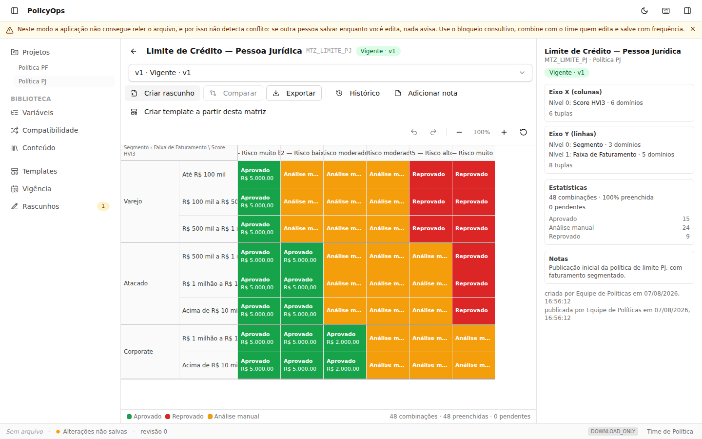
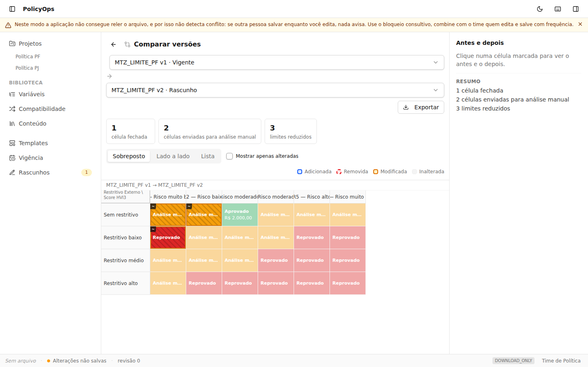
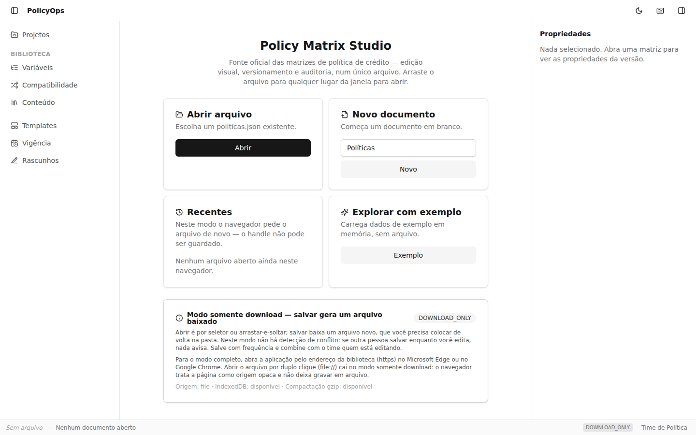
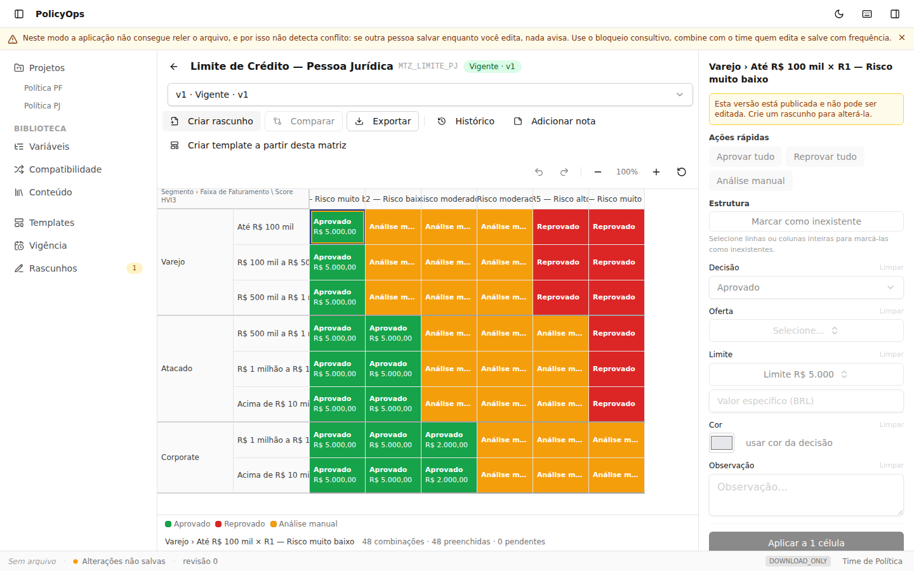

# Policy Matrix Studio

Fonte oficial das matrizes de política de crédito — os "cineminhas" — com edição visual, versionamento, auditoria e consulta histórica.

**Um único arquivo `.html`.** Sem instalar nada, sem servidor, sem banco de dados. Você coloca `PolicyOps.html` numa biblioteca do SharePoint, o time abre no navegador, edita e salva.

> **Status: MVP completo — marco M5 alcançado.** As 17 sessões do roadmap estão implementadas: bibliotecas, editor com eixos aninhados, seleção hierárquica e edição em massa, ciclo de vida e histórico, comparação de versões, vigência por data, reconciliação da biblioteca, templates, merge de documentos e exportação (JSON, CSV e PNG). Veja o [Guia do Usuário](docs/10-guia-do-usuario.md) para aprender a usar, e [Operação](docs/11-operacao.md) para manter a pasta compartilhada.

## Capturas de tela

| Grid aninhado, com export e legenda | Comparação de versões |
|---|---|
|  |  |

| Tela inicial | Inspector de célula |
|---|---|
|  |  |

## Guia de 5 minutos

1. **Baixe** `dist/PolicyOps.html` deste repositório (veja "Como baixar e usar" logo abaixo) e coloque numa pasta do SharePoint.
2. **Abra** o arquivo pelo endereço da biblioteca (não por duplo clique — veja por quê na seção seguinte). Na primeira vez, diga como quer ser identificado.
3. **Explore com dados de exemplo** — sem precisar de arquivo nenhum, para conhecer a ferramenta sem risco. Ou **Novo documento**, se já quiser começar do zero.
4. Em **Biblioteca › Variáveis**, confira as variáveis já existentes (ou crie uma nova e publique a primeira versão — só variáveis publicadas entram numa matriz).
5. Em **Projetos**, crie um projeto e, dentro dele, **Nova matriz** — escolha as variáveis dos eixos X e Y (ou parta de um template pronto).
6. Preencha as células (clique único ou selecione várias de uma vez) com decisão, oferta e limite pelo painel à direita.
7. **Publique** a versão — é obrigatório descrever o que mudou. A partir daí ela é imutável e vira a vigente.
8. Use o menu **Exportar** (no editor, na comparação ou na tela de vigência) para gerar JSON, CSV ou PNG — o PNG já sai pronto para virar slide de comitê.

O [Guia do Usuário](docs/10-guia-do-usuario.md) cobre cada um desses passos em detalhe, com um glossário para quem chega sem contexto técnico.

## O problema

Matrizes de política vivem hoje em Excel, PowerPoint e imagens. Ninguém sabe ao certo qual é a versão vigente, não há histórico das alterações, e o risco de divergência entre a documentação e o motor de crédito é permanente.

## As duas ideias que sustentam a solução

**Variáveis são entidades versionadas, não texto.** Score HVI3, Segmento e Faixa de Faturamento vivem numa biblioteca. Uma matriz escolhe variáveis para seus eixos e **congela um snapshot** delas. A biblioteca evolui livremente; versões publicadas nunca mudam. O lastro fica preservado, e o usuário decide caso a caso quando adotar a evolução.

**Um eixo é uma pilha de até 3 variáveis.** `Segmento › Faixa de Faturamento` no eixo vertical, `Score` no horizontal. Combinações que não existem no mundo real — Varejo não fatura acima de 1M — são declaradas uma vez na **biblioteca de compatibilidade** e valem para todas as matrizes.

```
                          │        Score HVI3            │
                          │  R1   R2   R3   R4   R5   R6 │
──────────────────────────┼──────────────────────────────┤
 Varejo   │ até 100k      │  ██   ██   ██   ██   ██   ██ │
          │ 100k – 500k   │  ██   ██   ██   ██   ██   ██ │
          │ 500k – 1M     │  ██   ██   ██   ██   ██   ██ │
──────────┼───────────────┼──────────────────────────────┤
 Atacado  │ 500k – 1M     │  ██   ██   ██   ██   ██   ██ │
          │ 1M – 10M      │  ██   ██   ██   ██   ██   ██ │
          │ acima de 10M  │  ██   ██   ██   ██   ██   ██ │
```

## Como fica na sua rede

```
\\SharePoint\Politicas\
   ├── PolicyOps.html       ← a aplicação (~500 KB), publicada uma vez
   ├── politicas.json       ← todos os dados, legível e versionado pelo SharePoint
   └── _backups/
```

## Como baixar e usar no SharePoint

1. Baixe `dist/PolicyOps.html` direto deste repositório (botão "Download raw file" no GitHub, ou `git clone` + copiar o arquivo). Não é preciso instalar Node nem rodar nenhum build — o arquivo já está pronto.
2. Coloque `PolicyOps.html` numa biblioteca de documentos do SharePoint, junto de onde o `politicas.json` vai morar.
3. Cada pessoa do time abre o `.html` **pelo endereço do SharePoint** ("Abrir no navegador"), no Microsoft Edge ou no Google Chrome. Não há servidor, não há instalação — o navegador basta.
4. Na primeira abertura, a aplicação pede um nome para identificar as edições no histórico (não é login).
5. Em seguida, escolha o `politicas.json` — ou comece um documento novo, ou explore com dados de exemplo, sem arquivo nenhum.

### Os dois modos, e por que a diferença importa

A aplicação detecta o que o navegador oferece e informa o modo ativo na tela inicial:

| | **Modo completo** | **Modo somente download** |
|---|---|---|
| Quando | Aberta pelo endereço da biblioteca (https), em Edge ou Chrome | Aberta por duplo clique (`file://`), ou em Firefox/Safari |
| Salvar | Grava direto no arquivo escolhido | Baixa um arquivo novo, que você repõe na pasta |
| Conflito | Detectado: se outra pessoa salvar antes, nada é sobrescrito | **Não detectado** — combine com o time quem está editando |
| Bloqueio consultivo e backups | Disponíveis | Indisponíveis |

Abrir o arquivo por duplo clique funciona, mas cai no modo somente download: o navegador trata a página como origem opaca e não permite gravar em arquivo. Para o ciclo completo, abra pelo endereço da biblioteca.

O autosave local (IndexedDB, a cada 3 segundos) vale nos dois modos: se o navegador cair antes de você salvar, a aplicação oferece recuperar o trabalho na próxima abertura.

Para backup, resolução de conflito, atualização do `.html` sem perder dados e o que responder quando pedirem uma alteração retroativa, veja [docs/11 — Operação](docs/11-operacao.md).

## Como desenvolver

Pré-requisitos: Node 22, pnpm.

```bash
pnpm install
pnpm dev              # servidor de desenvolvimento com hot reload
pnpm build            # gera dist/PolicyOps.html
pnpm check-selfcontained  # garante que o HTML gerado não tem nenhuma referência externa
pnpm lint
pnpm typecheck
pnpm test:unit
pnpm test:e2e         # abre dist/PolicyOps.html por file:// com Playwright — rode "pnpm build" antes
```

`pnpm test:e2e` baixa o Chromium do Playwright na primeira execução (`pnpm exec playwright install --with-deps chromium`), a menos que a variável de ambiente `PLAYWRIGHT_CHROMIUM_PATH` já aponte para um Chromium instalado localmente.

Toda sessão de implementação termina com `pnpm lint && pnpm typecheck && pnpm test:unit && pnpm build` verdes e `dist/PolicyOps.html` atualizado no commit — é esse arquivo que vai para o SharePoint.

## Documentação

| Documento                                                                  | Conteúdo                                                   |
| -------------------------------------------------------------------------- | ---------------------------------------------------------- |
| [01 — Visão e escopo](docs/01-visao-e-escopo.md)                           | Problema, conceitos, escopo do MVP, premissas              |
| [02 — Arquitetura](docs/02-arquitetura.md)                                 | Stack, arquivo único, camadas, restrições do bundle        |
| [03 — Modelo do documento](docs/03-modelo-do-documento.md)                 | Schema JSON completo, invariantes, exemplo                 |
| [04 — Eixos aninhados](docs/04-eixos-aninhados.md)                         | Tuplas, compatibilidade, cabeçalhos, operações de nível    |
| [05 — Regras de negócio](docs/05-regras-de-negocio.md)                     | Versionamento, células, diff, reconciliação                |
| [06 — Persistência e concorrência](docs/06-persistencia-e-concorrencia.md) | Abrir, salvar, conflito, merge, autosave, recuperação      |
| [07 — UX e editor](docs/07-ux-e-editor.md)                                 | Shell, grid, seleção hierárquica, edição em massa          |
| [08 — Camada de comandos](docs/08-camada-de-comandos.md)                   | Contrato interno, catálogo de comandos, formatos de export |
| [09 — Roadmap](docs/09-roadmap-de-entregas.md)                             | As 17 sessões, modelos recomendados, marcos                |
| [10 — Guia do usuário](docs/10-guia-do-usuario.md)                         | Glossário e passo a passo para o time de política, sem jargão técnico |
| [11 — Operação](docs/11-operacao.md)                                       | Onde ficam os arquivos, backup, conflito, atualização, alteração retroativa |
| [Prompts](docs/prompts/)                                                   | Um prompt pronto por sessão                                |

## Como executar o plano

Uma sessão por vez, na ordem, cada uma numa conversa nova do Claude Code na raiz deste repositório:

1. `/model` → selecione o modelo indicado.
2. Cole o conteúdo de `docs/prompts/SXX-*.md`.
3. Confira os critérios de aceite do próprio prompt antes de aceitar o commit.
4. Verifique que `dist/PolicyOps.html` foi atualizado — é o arquivo que vai para o SharePoint.

| #   | Sessão                                | Modelo   |
| --- | ------------------------------------- | -------- |
| 01  | Scaffold e build de arquivo único     | Sonnet   |
| 02  | Modelo do documento e validação       | Sonnet   |
| 03  | Motor de eixos aninhados              | **Opus** |
| 04  | Store, comandos, undo/redo            | **Opus** |
| 05  | Persistência: abrir, salvar, conflito | **Opus** |
| 06  | Biblioteca de Variáveis               | Sonnet   |
| 07  | Biblioteca de Compatibilidade         | Sonnet   |
| 08  | Biblioteca de Conteúdo                | Haiku    |
| 09  | Projetos, matrizes e grid aninhado    | Sonnet   |
| 10  | Engine de seleção hierárquica         | **Opus** |
| 11  | Inspector e edição em massa           | Sonnet   |
| 12  | Operações de nível nos eixos          | **Opus** |
| 13  | Ciclo de vida e histórico             | Sonnet   |
| 14  | Diff e comparação                     | **Opus** |
| 15  | Vigência por data e portfólio         | Sonnet   |
| 16  | Reconciliação da biblioteca           | **Opus** |
| 17  | Templates, merge, export e polimento  | **Opus** |

**Marcos:** M1 roda e salva (após S05) · M2 bibliotecas prontas (S08) · M3 editor funcionando (S11) · **M4 substitui o Excel (S15)** · M5 MVP completo (S17).

## Stack

Vite 6 · React 19 · TypeScript · Zustand · Zod · Tailwind v4 · Radix UI · Vitest · Playwright

Sem backend, sem banco, sem requisições de rede em tempo de execução. Decidida em [docs/02](docs/02-arquitetura.md) — as sessões de implementação não devem alterá-la.
